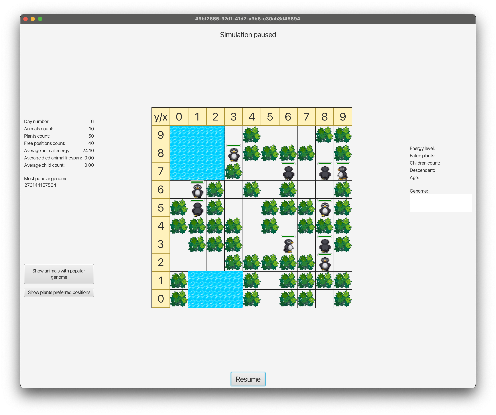
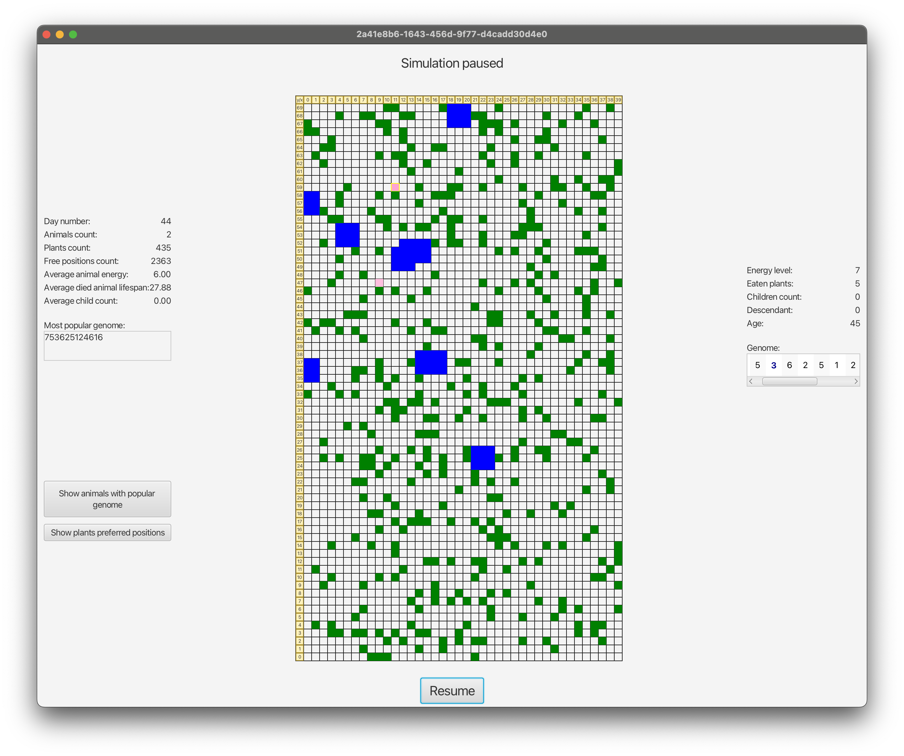

# darwin-simulation


## Overview
Darwin Simulation is a Java-based application that simulates the evolution of animals in different environments. The simulation allows users to configure various parameters related to the map, animals, and simulation settings.

## Features
- Configurable map types (Earth, Ocean)
- Configurable animal types (Normal, Aging)
- Adjustable simulation parameters such as map size, grass growth, animal energy levels, and more
- CSV statistics saving for simulation data
- Dynamic UI updates based on user input

## Technologies Used
- Java
- JavaFX for the user interface
- Gradle for build automation

## Getting Started

### Installation
1. Clone the repository:
    ```sh
    git clone https://github.com/yourusername/darwin-simulation.git
    cd darwin-simulation
    ```

2. Build the project using Gradle:
    ```sh
    ./gradlew build
    ```

3. Run the application:
    ```sh
    ./gradlew run
    ```

## Usage
1. Launch the application.
2. Configure the simulation parameters using the provided UI fields.
3. Click the "Start" button to begin the simulation.
4. Monitor the simulation progress and view statistics.
5. Save the configuration or load a previously saved configuration as needed.

## Configuration Parameters
- **Map Configuration:**
    - Map Width
    - Map Height
    - Starting Grass Count
    - Grass Growth Per Day
    - Grass Energy Level
    - Map Type (Earth, Ocean)
    - Starting Ocean Count (for Ocean map)
    - Water Segments (for Ocean map)
    - Ocean Change Rate (for Ocean map)

- **Animal Configuration:**
    - Animal Type (Normal, Aging)
    - Starting Animals Count
    - Animal Starting Energy
    - Animal Ready to Breed Energy Level
    - Animal Energy Loss Per Move
    - Animal Energy Given to Child
    - Chance of Animal Skip Move (for Aging animals)

- **Genome Configuration:**
    - Genome Length
    - Minimal Mutations Count
    - Maximal Mutations Count

- **Simulation Configuration:**
    - Simulation Speed
    - Total Simulation Days
    - CSV Statistic Saving

## Screenshots

[//]: # (### Configuration Window)

[//]: # (![Configuration Window]&#40;configuration.png "Configuration Window"&#41;)

### Example of Small Map


### Example of Large Map

